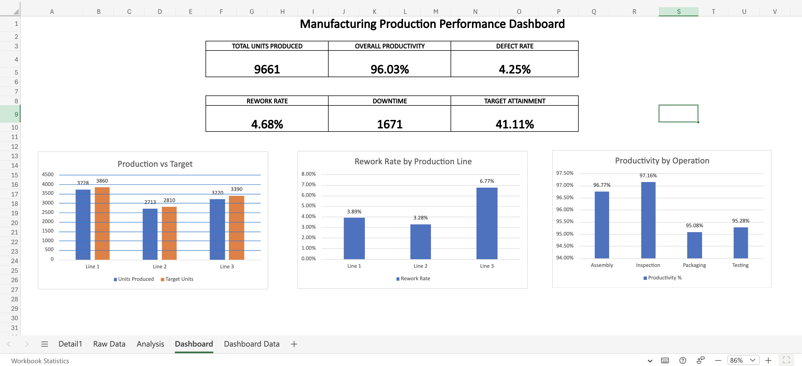

# Manufacturing Production Analysis

Excel manufacturing production analysis featuring data cleaning, PivotTables, KPI tracking, and a performance dashboard.

## Project Overview

Analyzed 90 manufacturing production records in Microsoft Excel to evaluate production output, productivity, defects, rework, downtime, target attainment, production-line performance, operational performance, and employee performance.

## Tools & Excel Skills

- PivotTables
- XLOOKUP
- IF and COUNTIF
- SUM and percentage calculations
- Data cleaning
- KPI development
- Dashboard creation
- Data visualization
- Operational data analysis

## Key Findings

- 9,661 total units produced
- 96.03% overall productivity
- 41.11% target attainment
- Line 3 had the lowest productivity at 94.99%
- Line 3 had the highest rework rate at 6.77%
- Inspection had the highest operational rework rate at 5.19%
- Packaging had the lowest operational productivity at 95.08%

## Recommendation

Further investigate Production Line 3 to determine factors contributing to its elevated rework rate and lower productivity. Inspection should also be monitored for rework, while Packaging should be reviewed for opportunities to improve productivity and overall target attainment.

## Dashboard Preview

